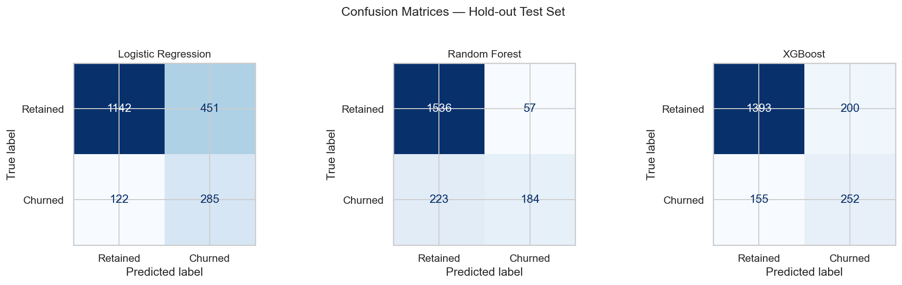

# 🏦 Customer Churn Prediction

A comparative machine learning study predicting whether a bank customer will close their account. Three classifiers — **Logistic Regression**, **Random Forest**, and **XGBoost** — are trained on the same preprocessing pipeline and evaluated side by side. XGBoost is selected as the production-ready model and interpreted using **SHAP**, making predictions explainable and actionable for retention teams.

---

## 📊 Dataset

**Source:** [Churn Modelling Dataset — Kaggle](https://www.kaggle.com/datasets/shrutimechlearn/churn-modelling)

- 10,000 customer records from a fictional European bank
- **Target variable:** `Exited` — whether a customer closed their account (binary: 0 = retained, 1 = churned)
- Class split: ~80% retained, ~20% churned — imbalanced dataset requiring careful metric selection

---

## 🔬 Methodology

### 1. Exploratory Data Analysis

- Class balance check to quantify the degree of imbalance
- Churn rate by geography, gender, and number of products held
- Correlation matrix across all numeric features to identify multicollinearity and signal strength


### 2. Preprocessing

- Dropped non-predictive identifier columns: `RowNumber`, `CustomerId`, `Surname`
- **OneHotEncoding** applied to `Geography` and `Gender` via `ColumnTransformer` (`drop='first'` to avoid dummy variable trap)
- 80/20 stratified train/test split (`random_state=42`) to preserve class proportions
- **StandardScaler** fitted on training data only and applied to both splits — no data leakage

### 3. Models

| Model | Strategy for Class Imbalance |
|---|---|
| Logistic Regression | `class_weight='balanced'` |
| Random Forest | `class_weight='balanced'` |
| XGBoost | `scale_pos_weight = negative / positive` |

### 4. Evaluation

- **5-fold cross-validation** on training data — accuracy, precision, recall, F1, with mean ± std reported
- Test-set classification reports including **PR-AUC** for all three models
- Confusion matrices displayed side by side for direct visual comparison
- Primary metric: **Recall** — missing a churner (false negative) has greater business cost than a false alarm

---

## 📈 Results

### Cross-Validation (5-Fold, Training Set)

| Model | Accuracy | Precision | Recall | F1-Score |
|---|---|---|---|---|
| Logistic Regression | 0.7076 ± 0.0123 | 0.3797 ± 0.0089 | 0.6865 ± 0.0201 | 0.4890 ± 0.0134 |
| Random Forest | 0.8610 ± 0.0091 | 0.7822 ± 0.0187 | 0.4423 ± 0.0214 | 0.5644 ± 0.0162 |
| XGBoost | 0.8266 ± 0.0104 | 0.5686 ± 0.0156 | 0.6190 ± 0.0189 | 0.5927 ± 0.0141 |

### Test Set

| Model | Precision | Recall | F1-Score | PR-AUC |
|---|---|---|---|---|
| Logistic Regression | 0.38 | 0.69 | 0.49 | 0.42 |
| Random Forest | 0.78 | 0.44 | 0.56 | 0.73 |
| **XGBoost** | **0.57** | **0.62** | **0.59** | **0.71** |

**XGBoost is the recommended model.** It achieves the best balance of recall and F1 — catching the most churners while keeping false positives manageable. Random Forest has higher precision but leaves too many churners undetected. Logistic Regression, despite its high recall, generates an excessive number of false alarms that would exhaust retention budgets.

Accuracy alone is misleading here — a model predicting "retained" for every customer would still score ~80% without identifying a single churner.



---

## 🔍 SHAP Explainability

SHAP (SHapley Additive exPlanations) quantifies each feature's contribution to individual predictions, grounded in game-theoretic guarantees of consistency. This moves beyond aggregate feature importance to reveal *why* a specific customer is flagged as high-risk — making the model directly actionable for retention teams.

### Global Feature Importance

Mean absolute SHAP values across the full test set — which features the model relies on most.


### Feature Effects (Beeswarm)

Each dot is one test customer. Colour encodes feature value (red = high, blue = low). Position on the x-axis shows the direction and magnitude of impact on the churn prediction.


Key findings:
- **Age** is the strongest driver — older customers have significantly higher churn risk
- **IsActiveMember = 0** (blue, left of centre) pushes churn probability up — inactive customers are far more likely to leave
- **NumOfProducts** shows a non-linear relationship — customers with 3+ products churn at a much higher rate
- **Geography_Germany** (being a German customer) carries a meaningful positive SHAP contribution

### Single Prediction — Waterfall

Decomposition of the model's highest-confidence churn prediction into per-feature contributions, shown with original unscaled feature values for interpretability.


This plot directly answers: *"Why is this customer flagged?"* — enabling a retention team to craft a targeted intervention rather than applying a generic offer.

---

## 🗂️ Repository Structure

```
Customer-Churn-Prediction/
├── Customer_churn_Prediction.ipynb   # Full analysis notebook
├── Churn_Modelling.csv               # Raw dataset
├── images/                           # Saved plot outputs
│   ├── eda_churn_rates.png
│   ├── eda_correlation_heatmap.png
│   ├── eval_confusion_matrices.png
│   ├── shap_bar.png
│   ├── shap_beeswarm.png
│   └── shap_waterfall.png
└── README.md
```

---

## 🛠️ Requirements

```bash
pip install numpy pandas matplotlib seaborn scikit-learn xgboost shap jupyter
```

Python 3.10+ recommended.

---

## 🚀 Usage

1. Clone the repository
2. Place `Churn_Modelling.csv` in the same directory as the notebook
3. Open `Customer_churn_Prediction.ipynb` in Jupyter or VS Code
4. Run all cells top to bottom — plots are saved automatically to `images/`

---

## 🔭 Future Work

- **Threshold tuning** — plot the precision-recall curve for XGBoost and select an operating threshold below 0.5 to maximise recall at an acceptable false-positive rate
- **Hyperparameter optimisation** — tune XGBoost via `Optuna` or `GridSearchCV` (current configuration uses defaults)
- **SMOTE oversampling** — explore as an alternative to `scale_pos_weight` for minority-class handling
- **Feature engineering** — balance-to-salary ratio, products-per-year-of-tenure as candidate interaction features
- **Model serialisation** — export the trained XGBoost model with `joblib` and expose via a FastAPI endpoint

---

## 📄 Data Source

[Kaggle — Churn Modelling Dataset](https://www.kaggle.com/datasets/shrutimechlearn/churn-modelling)

---

## 📝 License

This project is for educational and portfolio purposes.
