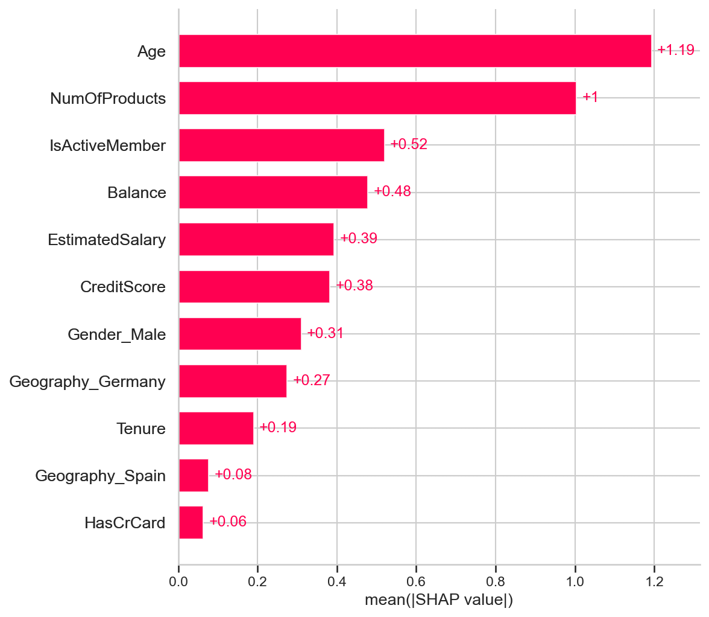
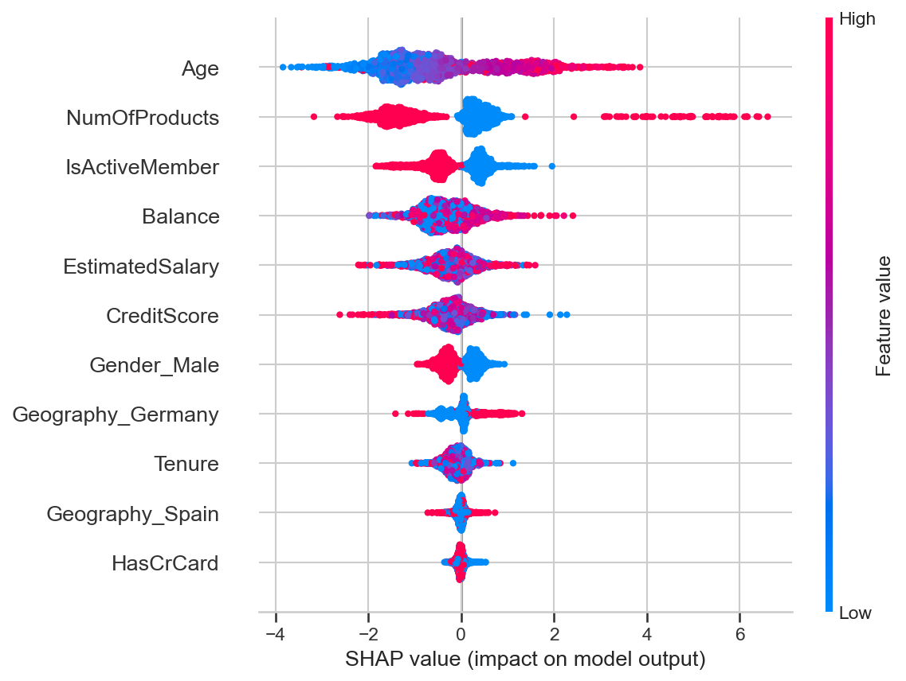
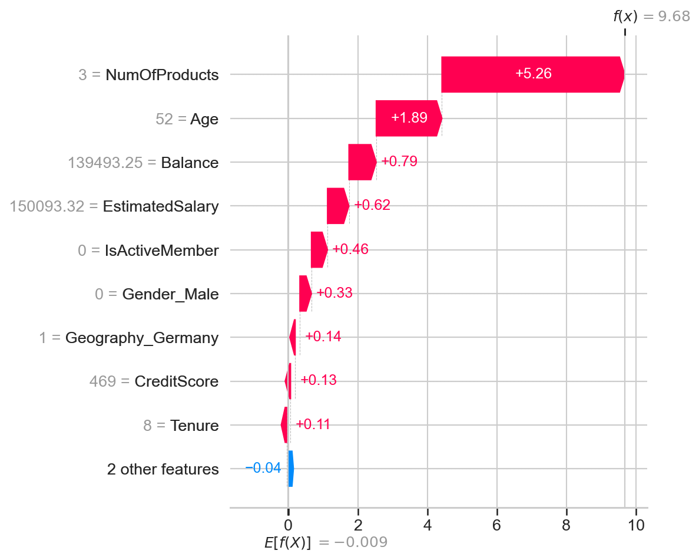
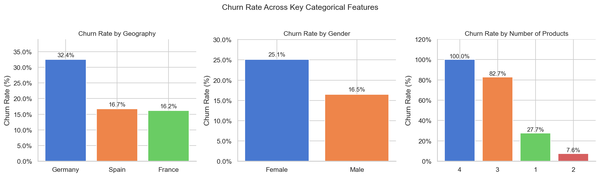
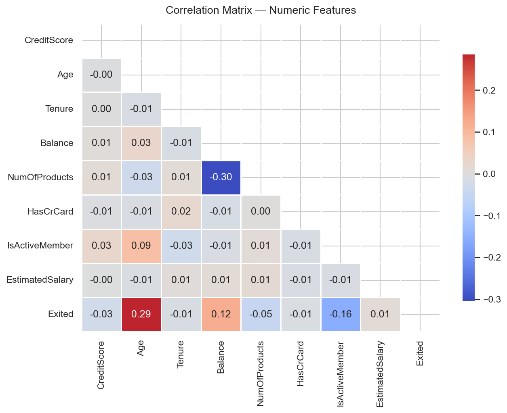

# 🏦 Customer Churn Prediction

A comparative machine learning study predicting whether a bank customer will close their account, using demographic and account data from 10,000 records. Three classifiers are benchmarked — Logistic Regression, Random Forest, and XGBoost — with SHAP analysis to explain what the winning model has learned.

---

## Results

| Model | CV Accuracy | CV Recall | CV F1 | Test Precision | Test Recall | Test F1 | PR-AUC |
|---|---|---|---|---|---|---|---|
| Logistic Regression | 0.7076 ± 0.0073 | 0.6865 ± 0.0184 | 0.4890 ± 0.0126 | 0.39 | 0.70 | 0.50 | 0.4680 |
| Random Forest | 0.8610 ± 0.0049 | 0.4423 ± 0.0227 | 0.5644 ± 0.0177 | 0.76 | 0.45 | 0.57 | 0.6809 |
| **XGBoost** | 0.8266 ± 0.0053 | 0.6190 ± 0.0142 | 0.5927 ± 0.0111 | 0.56 | 0.62 | 0.59 | 0.6600 |

> **XGBoost is the recommended model.** Accuracy alone is misleading given the ~80/20 class split — a model that always predicts "retained" would score 80% without catching a single churner. Recall and PR-AUC are the primary evaluation signals.


---

## Key Findings

**Age is the strongest churn signal**, confirmed by both EDA and SHAP — older customers churn at a significantly higher rate independent of other factors.

**Inactive members are the highest-priority retention target.** `IsActiveMember = 0` is the second most impactful SHAP feature, meaning disengagement is a leading indicator of churn regardless of account balance or tenure.

**Germany shows an elevated churn rate** relative to France and Spain — a geographic pattern visible in EDA and echoed in SHAP via the `Geography_Germany` feature contribution.

**NumOfProducts has a non-linear relationship with churn.** Customers with 3 or 4 products churn at a much higher rate than those with 1 or 2, which contradicts a naive "more products = more loyalty" assumption and is only detectable by tree-based models.

**Class imbalance shapes every modelling decision.** The 80/20 split is handled via `class_weight='balanced'` for Logistic Regression and Random Forest, and `scale_pos_weight = negative / positive` for XGBoost. PR-AUC is reported alongside F1 as it is more sensitive than ROC-AUC under imbalance.

**Logistic Regression maximises recall** but at the cost of a high false-alarm rate. **Random Forest maximises precision** but misses too many real churners. **XGBoost strikes the better practical balance** — confirmed as the recommended production model.

---

## SHAP Analysis

SHAP (SHapley Additive exPlanations) values explain XGBoost's predictions at both a global and individual level. Feature names are extracted directly from the `ColumnTransformer` pipeline. The waterfall plot reconstructs original unscaled feature values via `StandardScaler.inverse_transform` so axes show interpretable numbers rather than z-scores.

[](images/shap_bar.png)

[](images/shap_beeswarm.png)

[](images/shap_waterfall.png)

---

## EDA

[](images/eda_churn_rates.png)

[](images/eda_correlation_heatmap.png)

---

## Project Structure

```
Customer-Churn-Prediction/
│
├── Customer_churn_Prediction.ipynb
│
├── images/
│   ├── eda_churn_rates.png
│   ├── eda_correlation_heatmap.png
│   ├── eval_confusion_matrices.png
│   ├── shap_bar.png
│   ├── shap_beeswarm.png
│   └── shap_waterfall.png
│
├── Churn_Modelling.csv
└── README.md
```

---

## Data

**Source:** [Churn Modelling Dataset — Kaggle](https://www.kaggle.com/datasets/shrutimechlearn/churn-modelling)

10,000 customer records from a fictional European bank. Target variable: `Exited` (1 = churned, 0 = retained). Class split: ~80% retained, ~20% churned. Place `Churn_Modelling.csv` in the same directory as the notebook before running.

---

## Setup

```bash
pip install numpy pandas matplotlib seaborn scikit-learn xgboost shap jupyter
```

Open and run `Customer_churn_Prediction.ipynb` top to bottom. All plots save automatically to `images/`.

---

## Methodology

- **Preprocessing:** Dropped non-predictive identifiers (`RowNumber`, `CustomerId`, `Surname`); OneHotEncoding on `Geography` and `Gender` via `ColumnTransformer` (`drop='first'`); stratified 80/20 train/test split (`random_state=42`); `StandardScaler` fitted on training data only — no data leakage
- **Class imbalance:** `class_weight='balanced'` for Logistic Regression and Random Forest; `scale_pos_weight = negative / positive` for XGBoost
- **Evaluation:** 5-fold cross-validation (mean ± std) on training set; test-set Precision, Recall, F1, PR-AUC; confusion matrices displayed side by side
- **Explainability:** SHAP `Explainer` on XGBoost — bar chart (global importance), beeswarm (direction + magnitude), waterfall (single high-confidence prediction with inverse-scaled feature values)
